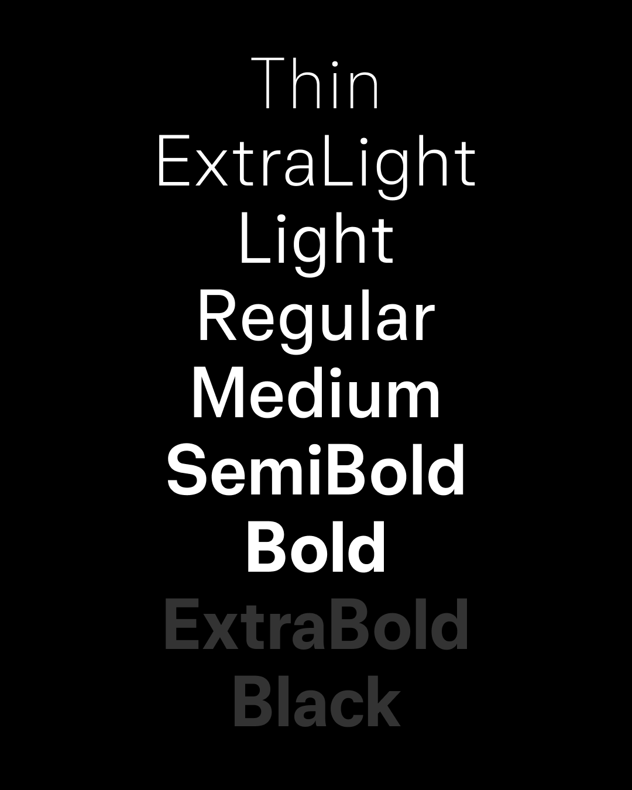

# Akt — a powerful typeface for modern user needs

**Unified glyphs width** across all weights (Thin → Black), ensuring predictable line and UI-element width behavior during text weight adjustments. This attribute also aids in optimizing text density for dark themes – simply shift one weight step lighter for balanced contrast.  
**Capitals** are vertically **centered within the line height**, creating harmonious alignment with icons. **Terminals** (endpoints of rounded strokes) are horizontally **calibrated** for visual consistency.  
**1,200+ glyphs** and supports **400+ languages** using **Extended Latin & Cyrillic** scripts.  
There are **7 font weights available** (Thin → Bold is ready, ExtraBold and Black still wip). Designed by Dima Grenev.

[Download](https://github.com/dimgrenev/Akt/releases/latest) latest release.

## Features

## Build

> **Note** To build from source, you'd need Python 3.9.5 or higher (install instructions for Python [available here](https://wiki.python.org/moin/BeginnersGuide/Download)).

The source files can be found in the *"Source"* folder. To open them you will need Glyphs app.\
To build the `.ttf`, `.otf`, `woff2` & variable `.ttf` you will need to:
- Install **gftools** `pip install gftools`
- Install **fonttools[woff]** `pip install fonttools[woff]`
- Navigate to **Akt** folder in Terminal app.
- Type `gftools builder sources/config.yaml` in Terminal and run it.
- Type `python scripts/generate_variable_webfonts.py` in Terminal and run it to generate variable `woff2` files.
- After the scripts are complete, the files can be found in *fonts* folder.

## License

This Font Software is licensed under the SIL Open Font License, Version 1.1.
This license is available with a FAQ at https://openfontlicense.org
